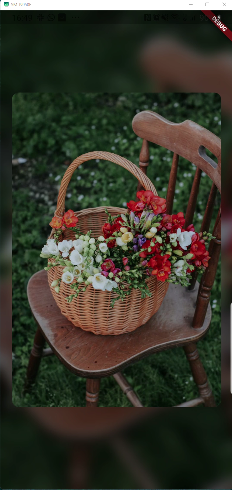
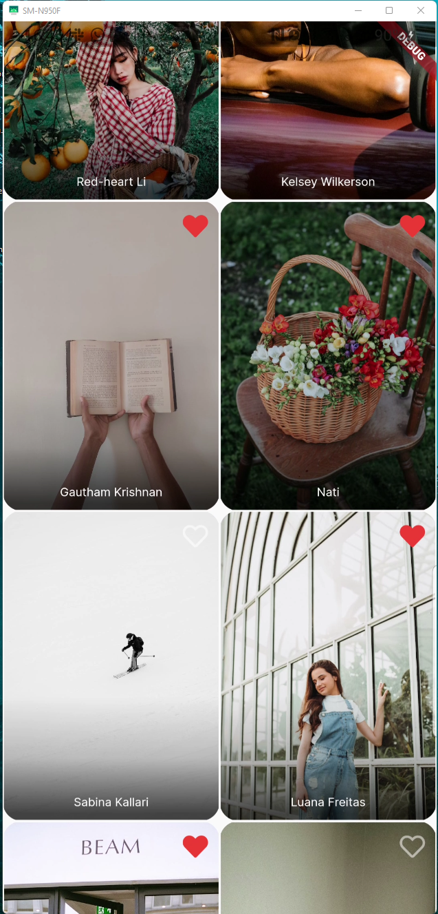

# photo_gallery

That's a simple Flutter application using Clean Architecture.  
The application shows photos of the following sources: 
https://jsonplaceholder.typicode.com 
https://api.pexels.com/v1 

Packages used in this project: 

flutter_bloc - State management 
dartz - For functional programming 
dio - To make http requests 
get_it - Dependency injection 
awesome_icon - Cool icons  
google_fonts - Beautiful fonts 

(app_home.png"Example Gif")

